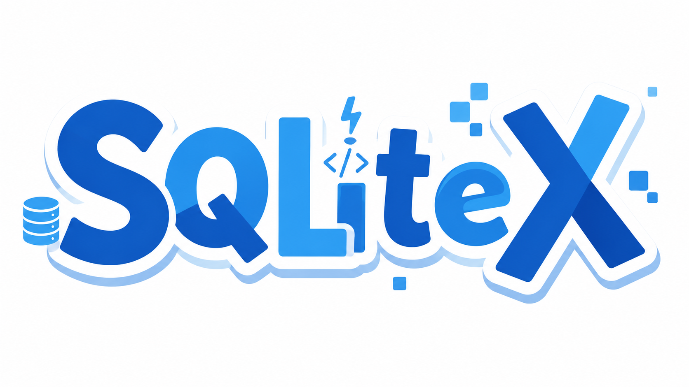

# SQLiteX

SQLiteX 是一个基于Go的编译时数据库，针对本地/云原生应用优化，旨在解决SQLite的性能问题同时保持轻量化。

> 📚 **文档**：快速上手 → [`docs/quickstart.md`](docs/quickstart.md) · Schema 指南 → [`docs/schema.md`](docs/schema.md) · API 参考 → [`docs/api.md`](docs/api.md) · TTL 生命周期 → [`docs/ttl.md`](docs/ttl.md) · 性能调优 → [`docs/performance.md`](docs/performance.md) · 可观测性 → [`docs/observability.md`](docs/observability.md) · 运维手册 → [`docs/ops.md`](docs/ops.md)

## 为什么有这个项目?

SQLiteX 是一个专为 Go 语言打造的极速、嵌入式、静态类型的键值数据库包（Package）。它诞生于对标准 SQLite 在处理高频写入与海量大二进制/长文本日志时性能瓶颈带来的问题。  

不同于传统的数据库，SQLiteX 摒弃了复杂的 SQL 引擎和运行时的类型反射损耗。它采用了一种全新的“编译时（Compile-Time）”设计理念：以 Protobuf 作为数据的绝对定义（Schema），在编译阶段通过代码生成，同时在内部实现强类型的底层 CRUD（增删改查）接口。  

## 架构设计

### 编译时引擎 (Compile-Time Code Generation)

_核心机制： 消除运行时反射 (Reflect)，实现 Struct 到 Bytes 的直接内存映射与强类型 API 生成。_

Schema 承载： 采用 Protobuf proto3 语法作为底层数据描述语言 (IDL)，通过自定义 Options 扩展存储语义。   
AST 解析与生成： 开发自定义的 Go 插件 protoc-gen-sqlitex。通过解析 Protobuf AST（抽象语法树），提取 Message 结构、字段类型与自定义 Options（如 [(sqlitex.compress)=true]、[(sqlitex.index)=UNIQUE]）。   
零反射序列化： 生成代码彻底抛弃 encoding/json 或运行时的 proto.Marshal。直接硬编码 binary.LittleEndian 或 varint 算法进行字段偏移量计算和字节拼接，实现内存无分配或极低分配的序列化。  
强类型 API 生成： 为每张表自动生成独立的 Go Interface、链式查询构建器 (Fluent API) 以及用于单元测试的 Mock 实现，实现业务层与存储层的高度解耦。  

### 底层存储与数据布局 (Storage Engine & Data Layout)

_核心机制： 复用工业级 LSM-Tree 引擎，聚焦上层数据结构与资源优化。_

底层引擎选型： 采用 Pebble (BSD-3-Clause) 作为底层存储基座。直接利用其运行后生成的原生目录结构（包含 WAL、SSTable 等），不做强行单文件打包，以获取最佳的稳定性、空间控制与工程优雅性。  
命名空间路由 (Prefix Encoding)： 采用字典序前缀编码区分不同表（Message）的数据。数据行 Key 为 `[0x00] + [TableHash 8B] + [PrimaryKey]`，索引行 Key 为 `[0xFF] + [TableHash 8B] + [FieldNum] + [ValueLen] + [FieldValue] + [PrimaryKey]`。其中 **TableHash 是消息全名（`go_package + "." + MessageName`）的 FNV-1a 64 位哈希**——只取决于包名与 Message 名，在 proto 中增删表、调整 Message 声明顺序都不会让既有表的哈希漂移，历史数据不会被静默路由到错误的表；codegen 在生成期做碰撞校验，冲突直接报错。`0x00` / `0xFF` 双 tag 让数据键空间与索引键空间彻底隔离，保证局部扫描的缓存命中率与逻辑隔离。  
Value 结构设计 (Meta + Payload)： 有 TTL 的表在 Value 头部携带 8 字节过期时间戳（Meta Header），其后为按字段顺序扁平拼接的 Payload（定长小端编码 / u32 前缀变长 / 压缩变长）。读取时按偏移直接定位字段，压缩字段按需解压，避免全量解压的 CPU 浪费。  

### 内存热缓存 (Hot Cache)

_核心机制： 在有限内存下精准捕获读热点，防止全表扫描污染缓存，保障高并发读性能。_

TinyLFU 热点探测： 引入极小内存（如 1MB）的 Count-Min Sketch 估算访问频率。仅允许访问频率超过动态阈值的 Key 进入热缓存，彻底免疫全表扫描或恶意请求导致的缓存污染（Cache Thrashing）。  
精确内存核算： 缓存条目按 len(key) + len(value) + 均摊开销精确计费，MaxBytes 管控的是真实内存占用；超过单条上限（如 >1MB）的大 Value 拒绝入缓存，进程级内存水位由写入侧背压兜底（见下节）。  

### 并发控制与写入优化 (Concurrency & Write Optimization)

_核心机制： 剥离传统 SQL 的全局锁，通过队列模型与底层 MVCC 实现高并发无锁读写与严格的资源管控。_

MPSC 队列与组提交 (Group Commit)： 实现多生产者单消费者模型。利用 Go 原生的带缓冲 channel 接收所有并发写请求，后台独占单个 Goroutine 消费。在极短时间窗口内将小批量写请求合并为单次 Pebble Batch 落盘，彻底转化随机 IO 为顺序 IO。  
背压限流与内存管控： 针对 MPSC 模型可能导致的 channel 膨胀问题，引入写队列长度限制与背压策略（Backpressure）。当队列满时直接拒绝写入；后台采样 `runtime.MemStats`，进程内存超限时拒绝新写入，结合 Pebble 的 MemTable 阈值实现严格的内存上限管控，防止海量突发写入导致 OOM。  
无锁读： 读操作由 Pebble 内部多版本（MVCC）机制保证一致性，读路径不经过写队列、与之零竞争，读性能不受写入压力影响。  

### 细粒度压缩与生命周期 (Fine-Grained Compression & Lifecycle)

_核心机制： 拒绝默认过度设计，按需压缩与惰性清理，极致优化 CPU 与 IO 资源。_

局部压缩机制： 放弃块级压缩。仅针对被 .proto Option 显式标记且大小超过特定阈值（如 256 Bytes）的变长字段调用 Zstd 或 LZ4 压缩。固定长度的元数据保持明文存放，业务过滤或分页查询时完全跳过解压指令。  
TTL 惰性删除 (Lazy Deletion)： 支持在 Protobuf 中声明 TTL，读取时进行轻量级过期校验（惰性删除）；未被读取的过期记录通过 PurgeExpired 主动清理接口回收。  

### 索引机制与游标分页 (Indexing & Cursor Pagination)

_核心机制： 编译时自动维护索引，强制 O(1) 游标寻址，消灭深分页性能灾难。_

自动化二级索引： 在 Protobuf 中引入索引 Option（如 [(sqlitex.index) = UNIQUE] 或普通索引）。编译时自动生成维护二级索引（IndexKey -> PrimaryKey）的写入逻辑与强类型查询 API，支持等值与前缀范围查询。  
游标分页算法 (Cursor Pagination)： API 强制采用游标机制，彻底抛弃传统 OFFSET。底层寻址键拼接为 `[0xFF] + [TableHash] + [FieldNum] + [LastIndexValue] + [LastPK]`，调用 Pebble 的 Seek 将迭代器瞬间移动到上一页物理边界并向后迭代，单次分页延迟始终恒定为 O(1)。  

### 开发者体验与可观测性 (Developer Experience & Observability)

_核心机制： 提供云原生友好的开发体验，内建生产级监控与运维工具。_

内建可观测性： 在生成的 CRUD 方法和写队列中原生提供 Prometheus Metrics 埋点，实时监控吞吐、延迟、热缓存命中率与队列深度。  
零停机热备份： 支持调用无阻塞的 Checkpoint/Snapshot API，利用 Pebble 底层的不可变快照特性，实现生产环境下的零停机热备份与数据导出。  
配套工具： `protoc-gen-sqlitex` 代码生成插件负责从 Proto 生成全部存储代码；`sqlitex-admin` 提供加载 Proto 与数据目录的只读 Web 调试面板（可视化数据浏览、Schema 查看与记录检视，仅供本机调试使用）。  

## License
MIT License
